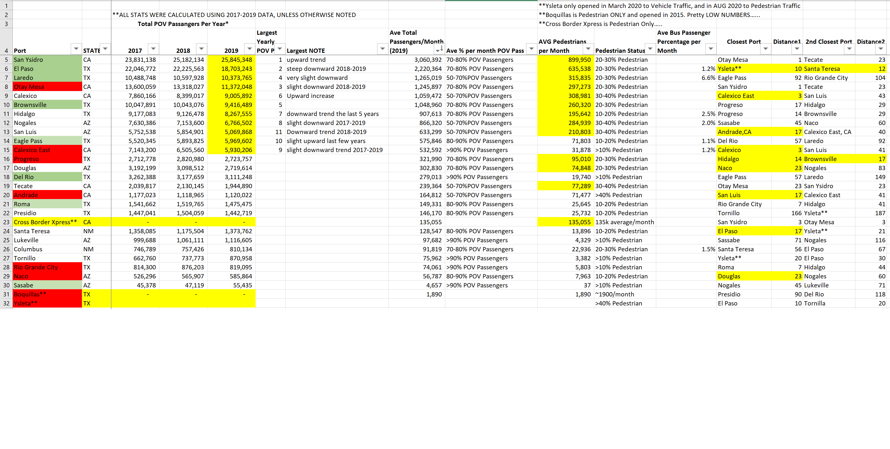

```{r setup, include=FALSE}
knitr::opts_chunk$set(echo = FALSE, message = FALSE, warning = FALSE, cache = TRUE, 
                       fig.align = "center", fig.width = 8)
```

```{r}

library(tidyverse)
library(lubridate)
library(forecast)
library(RSocrata)
library(knitr)
library(scales)
require(magrittr)
load('border_crossings.rda')
```

## FA49QRS

<br>

### MEMORANDUM FOR U.S. Army Analytic Agency
### ATTN: Ms. Janet Smith

<br>

### SUBJECT: United States Border Crossing Information Paper

<br>

<br>

1.Purpose: To provide insights gathered from the border crossing/entry dataset.

<br>

2.Background: The Border Crossing/Entry dataset contains `r format(nrow(data_pull), big.mark=",")` records, pertaining to `r ncol(data_pull)` distinct measures (variables). The dataset specifically measures border crossing at the U.S.-Canada and the U.S.-Mexico border, at the port level[^1].  Data are available for the following crossing methods: `r unique(data_pull$measure)`[^2]. Data are available from `r format(min(data_pull$date), format = '%Y')`, for 103  of 117 port cities, with multiple additional dates for the remaining ports.

<br>

3.Data Preparation: Using the SODA API provided by the Bureau of Transportation, the data was integested into R using the following API call:

```{r echo=TRUE, include = TRUE, eval=FALSE}
data_pull <- read.socrata("https://data.bts.gov/resource/keg4-3bc2.json")
data_pull <- data_pull %>% mutate(., value = as.numeric(value))
data_pull <- data_pull %>% mutate(., measure = as.factor(measure))
data_pull <- data_pull %>% mutate(year = format(date, format="%Y"))
```

Once ingested, the variable 'value' was transformed to numeric, 'measure' transformed to a factor, and a new variable, 'year', created for aggregation of years for statistical comparison.  


<br> 

4.Discussion: The border crossing dataset presents various interesting facets, to include periodicity of the port cities, differences between northern and southern borders, anomolies, and future forecasts.

<br>

  a. Every border crossing city experiences periodicity of some sort, especially those where Personal Vehicle Passengers and pedestrian traffic is predominant. This phenomenon is evident in Piegan, MT (Figure A), where both personal vehicles and Personal Vehicle Passengers are the predominant method of transportation, and significant spikes occur each year.  Similarly, we see that a similar trend is present for Skagway, AK, with buss passengers as the predominant mode of transportation (Figure B).  

<br>

  b. There exists a significantly larger traffic footprint at the U.S.-Mexico border, than the U.S.-Canada border. Although inference is not made with regards to reasons, in the largest metric, Personal Vehicle Passengers, the largest yearly value for the US-Mexico border is nearly doube that of the US-Canada border. Within the US-Mexico subset, even greater variation exists between port cities, where Personal Vehicle Passengers range from zero(not allowed) to in excess of 23 million per year.

<br>

  c. Multiple anomolies exist within the dataset that warrant further examination, outside of the current research. In the port city of Van Buren, Maine (Figure C), the metric for Personal Vehicle Passengers decreases to zero, causing large downward spikes in the time series graph. Similarly, in Point Roberts, Washington (Figure D) there is a signficant spike in Personal Vehicle Passengers, well beyond the normal seasonl variation. Finally, for all port cities, significant declines in all metrics occur around 2020, which can be attributed to COVID restrictions, but is still anomalous given the entire time series presented.
 
<br>
 
  d. Forecasts for any given port may produce inaccurate results, given the significant decrease in port traffic at the beginin of 2020, as shown in Figures A through D. Using Personal Vehicle Passenger data for the port city of Del Rio, TX, the expected forecast would continue trends seen in previous months (Figure E).  This however, is not representative of the data, and in Figure E, there is a clear difference between the forecast and true data.  The forecast in Figure E was created using an ARIMA(0,1,1) model, but could not account for the rapid decline in traffic due to COVID.

<br>

5.Findings:  From the data, it is evident there are differences between port cities and both borders. If the necessity arose for US Army support to Homeland Security (DHS) at a given port, greater impact would likely come from deployment to the southern border.  Similarly, multiple ports present greater overall volume of traffic than others, and would therefore need additional support.  From Figure F, we see the vast difference between southern border ports in places like San Ysidro, and potential support planning could easily account for ports with a greater volume of traffic.

Along with site selection, the time of year must be taken into account, given the periodicity of port traffic. ALthough variation exists, most ports experience spikes in traffic during certain months of the year, which would allow further granular support planning, if necessary.

Finally, though numbers are rebounding, caution should be taken to forecast future port traffic based on data collected begining in 2020, due to the COVID epidemic. Forecasts for future traffic could discount or mitigate the decrease in 2020, given the eventual return to normalcy post COVID.

All of the factors presented above give various analytical insights to leaders, should the need arise for the Army to provide support to DHS and border security.

<br>

MAJ Nicholas Uhorchak / 254-317-9339
Official: LTC Spivey

\newpage

### Appendix 1 - Figures

<br>

```{r Piegan}
data_pull %>% 
  filter(port_name == 'Piegan') %>%
  ggplot(., aes(date, value, color=measure, linetype=measure)) + geom_line() +
  theme(axis.text.x = element_text(angle = 90)) +
  ggtitle("Figure A - Piegan, MT Port Entries") +
  ylab("Total Entries") + xlab("Date")
```

<br> 

```{r Skagway}
data_pull %>% 
  filter(port_name == 'Skagway') %>%
  ggplot(., aes(date, value, color=measure, linetype=measure)) + geom_line() +
  theme(axis.text.x = element_text(angle = 90)) +
  ggtitle("Figure B - Skagway, AK Port Entries") +
  ylab("Total Entries") + xlab("Date")
```

```{r Van Buren}
data_pull %>% 
  filter(port_name == 'Van Buren') %>%
  ggplot(., aes(date, value, color=measure, linetype=measure)) + geom_line() +
  theme(axis.text.x = element_text(angle = 90)) +
  ggtitle("Figure C - Van Buren, ME Port Entries") +
  ylab("Total Entries") + xlab("Date")
```

```{r Point Roberts}
data_pull %>% 
  filter(port_name == 'Point Roberts') %>%
  ggplot(., aes(date, value, color=measure, linetype=measure)) + geom_line() +
  theme(axis.text.x = element_text(angle = 90)) +
  ggtitle("Figure D - Point Roberts, WA Port Entries") +
  ylab("Total Entries") + xlab("Date")
```

```{r ARIMA}
del_rio_PPV <- data_pull %>% 
  filter(port_name == 'Del Rio') %>% 
  filter(measure == 'Personal Vehicle Passengers') %>% 
  arrange(date) %>% 
  select(value) %>% ts(., start= c(1996,1), end = c(2020,1), frequency = 12)

fit_arima <- auto.arima(del_rio_PPV)
forecast_arima <- forecast(fit_arima, 14)

del_rio_data_PPV <- data_pull %>% 
  filter(port_name == 'Del Rio') %>% 
  filter(measure == 'Personal Vehicle Passengers') %>% 
  select(date, value) %>% arrange(date)

forecast_del_rio <- del_rio_data_PPV %>% 
  filter(date >= '2020-02-01') %>% 
  select(-value) %>% arrange(date) %>% 
  cbind(., forecast_arima$mean)
colnames(forecast_del_rio)[2] <- "forecast"


ggplot() + geom_line(data = del_rio_data_PPV, 
                     aes(date, value, color =  'blue')) +
  geom_line(data = forecast_del_rio, aes(date, forecast, color = 'red')) +
  scale_colour_hue('Values', labels=c('Actual', 'Forecast')) +
  ggtitle("Figure E - Del Rio, TX Personal Vehicle Passengers") +
  xlab('Date') + ylab('Monthly Total') +
  scale_y_continuous(
    labels = scales::number_format(accuracy = 1,
                                   decimal.mark = ','))
```




[^1]: Border Crossing/Entry Data. Accessed on 11Jun21. https://www.bts.gov/browse-statistical-products-and-data/border-crossing-data/border-crossingentry-data
[^2]: Ibid.
